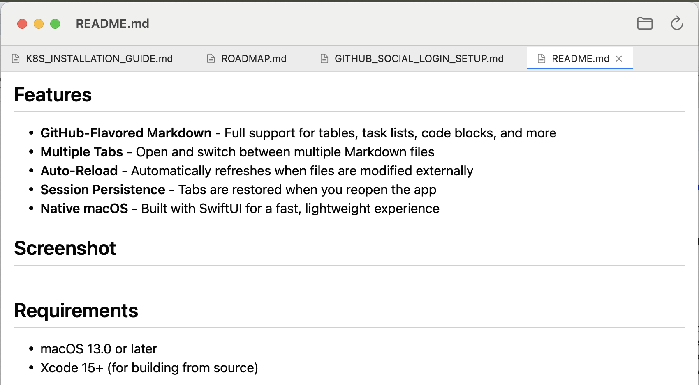

# MDViewer

<p align="center">
  
</p>

<p align="center">
  A native macOS Markdown viewer with GitHub-flavored rendering, tabs, and auto-reload.
</p>

## Features

- **GitHub-Flavored Markdown** - Full support for tables, task lists, code blocks, and more
- **Multiple Tabs** - Open and switch between multiple Markdown files
- **Auto-Reload** - Automatically refreshes when files are modified externally
- **Session Persistence** - Tabs are restored when you reopen the app
- **Native macOS** - Built with SwiftUI for a fast, lightweight experience

## Screenshot



## Requirements

- macOS 13.0 or later
- Xcode 15+ (for building from source)

## Installation

### Build from Source

1. Clone the repository:
   ```bash
   git clone https://github.com/doctorvibe/mdviewer.git
   cd mdviewer/MDViewer
   ```

2. Build with Swift:
   ```bash
   swift build -c release
   ```

3. The built app will be in `.build/release/MDViewer`

### Open in Xcode

1. Open `Package.swift` in Xcode
2. Select the MDViewer scheme
3. Build and run (⌘R)

## Usage

- **Open File**: `⌘O` or click the folder icon in the toolbar
- **Switch Tabs**: Click on a tab to view that file
- **Close Tab**: Hover over a tab and click the X button
- **Reload**: Click the reload button or the file auto-reloads on external changes

## Dependencies

- [swift-markdown-ui](https://github.com/gonzalezreal/swift-markdown-ui) - GitHub-flavored Markdown rendering

## License

MIT License

## Contributing

Contributions are welcome! Please feel free to submit a Pull Request.
